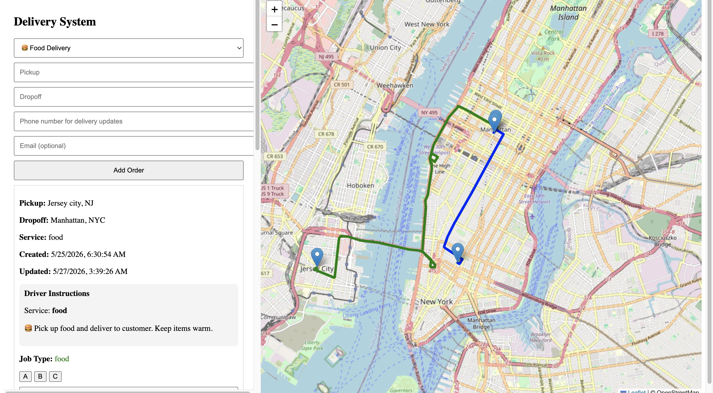
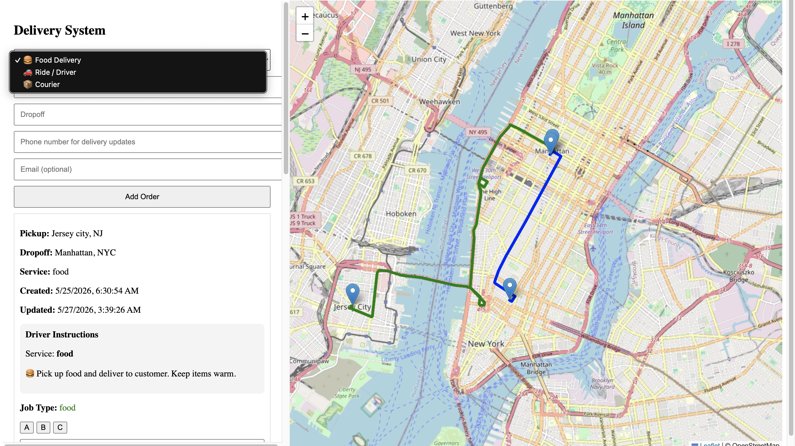
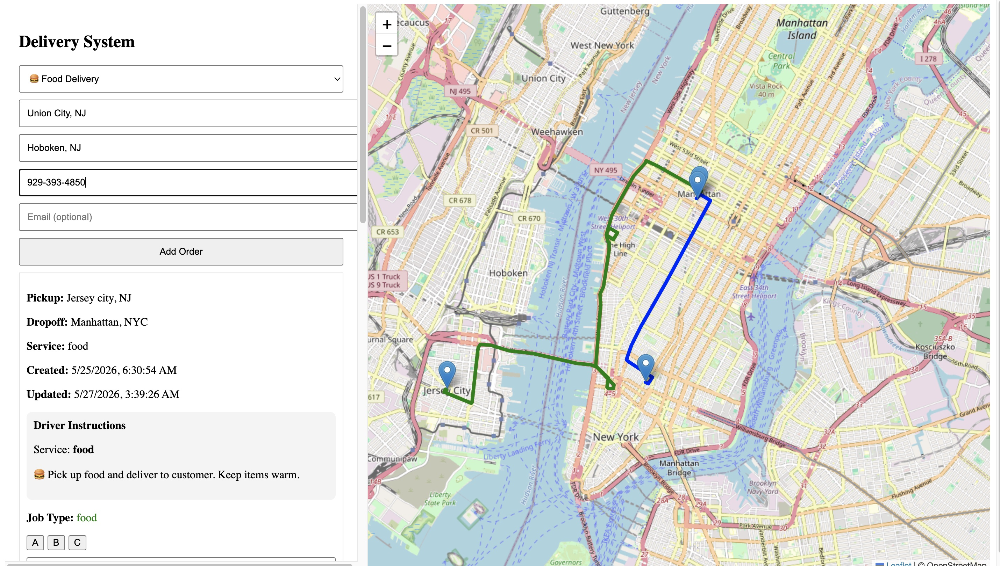
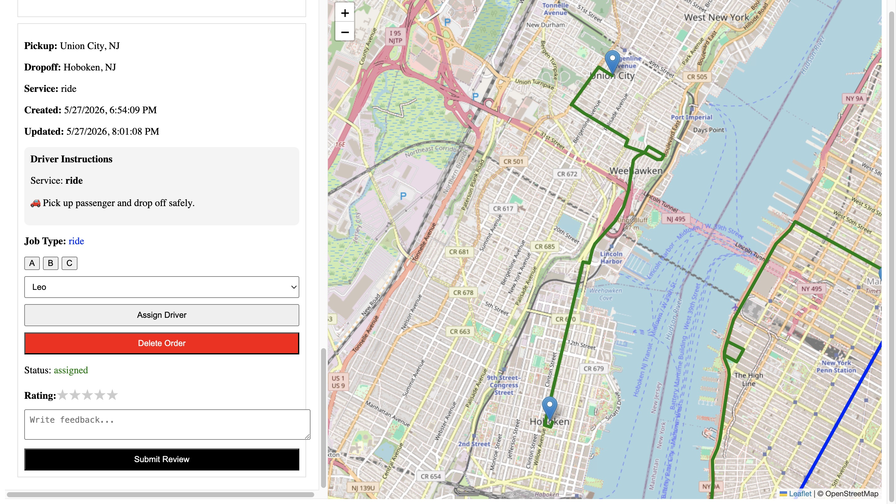
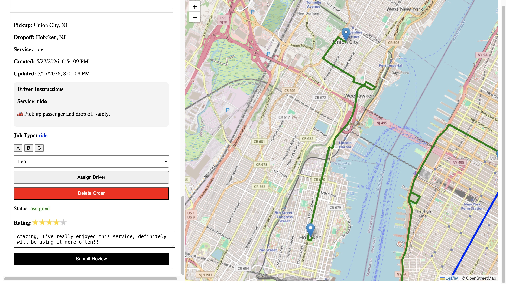
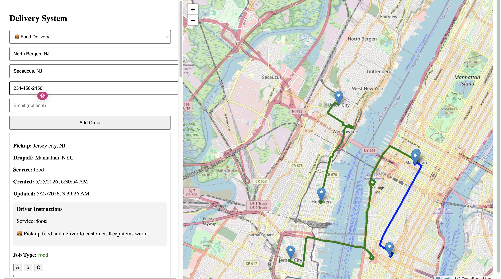
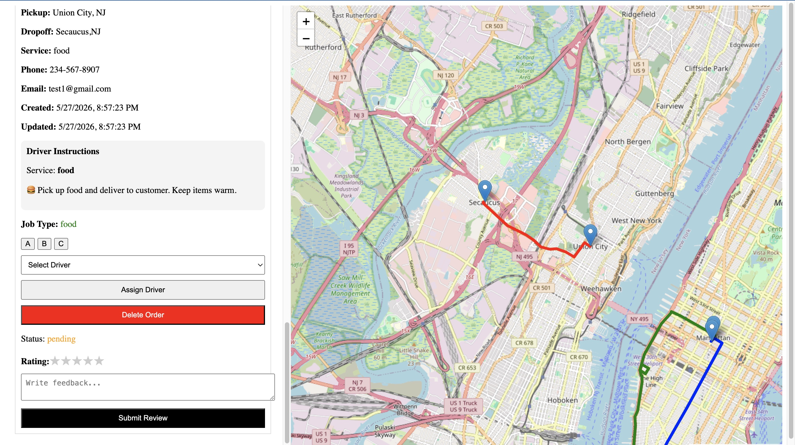
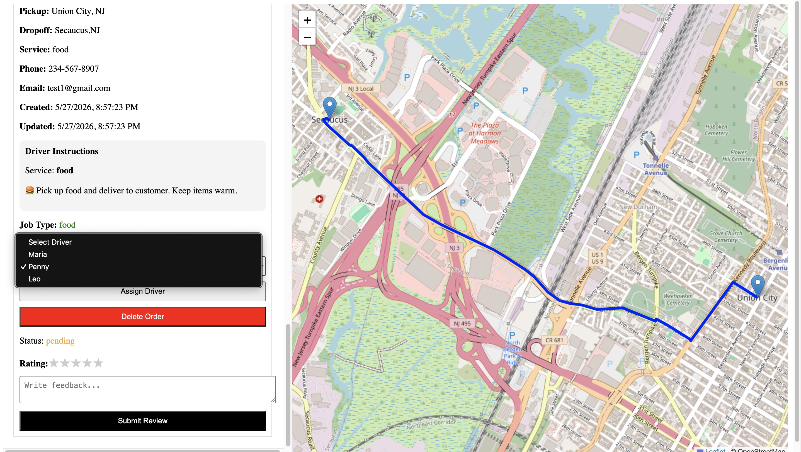
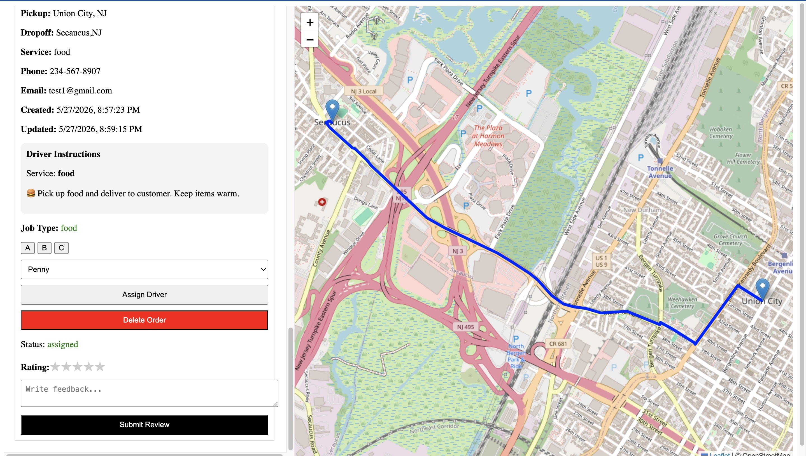

🚚 Real-Time Smart Delivery Dispatch System

A real-time logistics and delivery optimization platform that tracks drivers, orders, and routes on an interactive map.
This system simulates how modern delivery platforms (like DoorDash or Uber Eats) coordinate logistics, dispatching, and live tracking in real time.

🚀 Live Demo
"https://delivery-optimizer-two.vercel.app" 
   

## 📸 Project Preview

### Delivery Dispatch App View

🧠 Key Features
🚚 Real-time driver tracking on interactive map
📦 Dynamic order assignment system
🗺️ Leaflet-based map visualization
🔄 Live updates for driver movement & status changes
📍 Route visualization between pickup and drop-off points
⚡ Scalable architecture for city-level logistics simulation
🧠 Intelligent dispatch logic (assignment system)
🛠 Tech Stack

🎯 Purpose

This project was built to simulate a real-world logistics and dispatch control system used in modern delivery platforms.

It focuses on:

Managing moving assets (drivers)
Assigning and tracking orders in real time
Visualizing routes and system activity on a map
Understanding how large-scale delivery systems coordinate operations

The goal is to demonstrate skills in real-time systems, mapping visualization, and full-stack coordination logic.

📌 Future Improvements
AI-powered route optimization
Predictive delivery time estimation
WebSocket upgrade for true real-time streaming
Authentication system (admin / driver / dispatcher roles)
Mobile app version (React Native)
Cloud deployment + scaling improvements
Historical analytics dashboard
